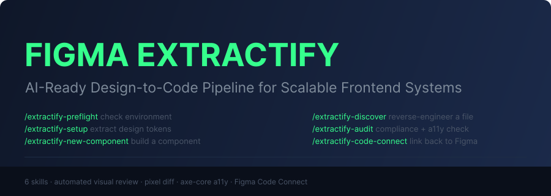

<p align="center">
  
</p>

<p align="center">
  <a href="./LICENSE"></a>
  <a href="https://github.com/99x/figma-extractify/actions/workflows/ci.yml"></a>
  <a href="https://github.com/99x/figma-extractify/issues"></a>
  <a href="https://github.com/99x/figma-extractify/pulls"></a>
</p>

# Figma Extractify

A monorepo with a Next.js + Tailwind boilerplate and a set of commands and rules to extract the design from Figma and translate it into code in a scalable way.

**Watch the walkthrough** to see everything in action: [figma-extractify.mp4](https://99xtech-my.sharepoint.com/:v:/g/personal/flavio_troszczanczuk_99x_io/IQDtzlCuetHxSq2-cZL4HodGAd2sc5C3l4alqb0NUOn8gns?nav=eyJyZWZlcnJhbEluZm8iOnsicmVmZXJyYWxBcHAiOiJPbmVEcml2ZUZvckJ1c2luZXNzIiwicmVmZXJyYWxBcHBQbGF0Zm9ybSI6IldlYiIsInJlZmVycmFsTW9kZSI6InZpZXciLCJyZWZlcnJhbFZpZXciOiJNeUZpbGVzTGlua0NvcHkifX0&e=dJqq3a)

---

## What's here

### [`figma-extractify/`](./figma-extractify)

The AI command system. Point it at any Figma file and extract your design tokens, build components with automated visual review, and link everything back to Figma Dev Mode.

Works with **Claude Code**, **Cursor**, **Windsurf**, and **GitHub Copilot**. Does not require the boilerplate — install it into any existing project.

→ [Read the Figma Extractify docs](./figma-extractify/README.md)

### [`boilerplate/`](./boilerplate)

A clean **Next.js 16 + Tailwind CSS v4** starter for building isolated, props-driven UI components. Includes GSAP, Swiper, react-hook-form, and Fancybox out of the box.

Works standalone. Figma Extractify is not required, but pairs perfectly with it.

→ [Read the Boilerplate docs](./boilerplate/README.md)

### [`example-file/`](./example-file)

Contains `example.fig` — a sample Figma file you can import into your Figma account to try the full extraction workflow without needing your own design file. Open it in Figma, grab the URLs for each page, and paste them into `_docs/figma-paths.yaml`.

---

## Repo structure

```
figma-extractify/          ← repo root (clone lands here)
├── figma-extractify/      ← the AI command system — install.sh lives here
│   ├── install.sh
│   ├── _docs/
│   └── .claude/
├── boilerplate/           ← Next.js + Tailwind starter (package.json lives here)
└── example-file/          ← sample .fig file to test extraction
```

## Requirements

- **Node.js** 18.17 or higher (Next.js 16 minimum — run `node --version` to check; update via [nvm](https://github.com/nvm-sh/nvm) or [nodejs.org](https://nodejs.org))
- An MCP-capable AI IDE: **Claude Code**, **Cursor**, **Windsurf**, or **GitHub Copilot**
- A **Figma MCP** connection — either Figma Desktop in Dev Mode (paid plan) or Figma Remote MCP via OAuth. Details: [figma-mcp-setup.md](figma-extractify/_docs/structure/figma-mcp-setup.md)
- **Optional (for visual review):** Playwright + Chromium. `install.sh` will install these for you.

## Using them together

The recommended setup — clone the repo, run the installer, and start extracting:

```bash
# 1. Clone the repo
git clone https://github.com/99x/figma-extractify.git

# 2. Open the boilerplate folder in your IDE (Claude Code, Cursor, etc.)
cd figma-extractify/boilerplate

# 3. Copy the figma-extractify folder into the boilerplate
cp -r ../figma-extractify .

# 4. Run the installer
bash figma-extractify/install.sh
# Windows: double-click figma-extractify\install.bat
#   or:    powershell -ExecutionPolicy Bypass -File figma-extractify\install.ps1

# The installer will:
#   - Install npm dependencies
#   - Copy /extractify-* commands to <project>/.claude/commands/ (project-scoped)
#   - Copy the figma-use skill to <project>/.claude/skills/ (required by use_figma)
#   - Copy _docs/, scripts/, CLAUDE.md, .mcp.json, and IDE config to your project
#   - Optionally install the visual QA toolchain (Playwright, pixelmatch, axe-core)
#   - Ask if you want to delete the figma-extractify/ folder (safe to do — all files are copied)

# 5. Restart Claude Code / Cursor so the new /extractify-* commands appear

# 6. Add your Figma URLs and start extracting
# → edit _docs/figma-paths.yaml (or use example-file/example.fig to try it out)
# → connect to Figma — either open Figma Desktop in Dev Mode (preferred)
#   OR let the IDE open the Remote MCP OAuth prompt (fallback, no desktop app needed)
# → npm run dev
# → /extractify-preflight
# → /extractify-setup
```

> **Note:** The installer copies everything it needs into the boilerplate project. After it finishes, the `figma-extractify/` folder is no longer needed — the installer will ask if you want to delete it.

## Using them separately

**Just the boilerplate** — clone and use `boilerplate/` as your project root. No AI tooling required.

**Just Figma Extractify** — copy the `figma-extractify/` folder into any existing Next.js project, then run `bash figma-extractify/install.sh` from inside it. It copies `.claude/`, `_docs/`, `scripts/`, `CLAUDE.md`, `.mcp.json`, and IDE config into your project without touching your source code.

---

## Contributing

Contributions are welcome! Please read the [Contributing Guide](CONTRIBUTING.md) before submitting a pull request.

## Code of Conduct

This project follows the [Contributor Covenant Code of Conduct](CODE_OF_CONDUCT.md). By participating, you are expected to uphold this code.

## License

This project is licensed under the [MIT License](LICENSE).

Copyright (c) 2026 [99x](https://99x.io).
